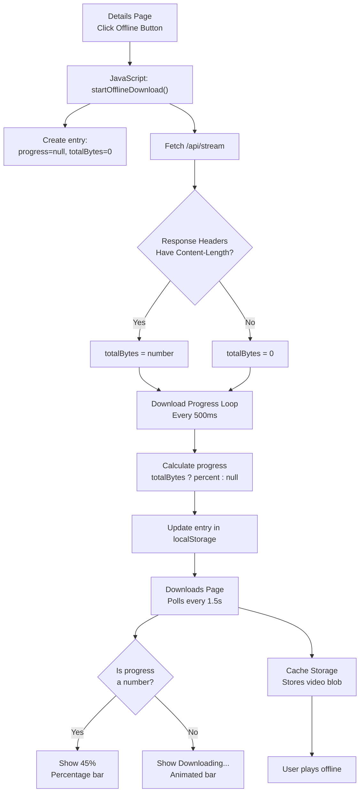

# Movie Download Progress Debugging Guide

## Summary of Changes

### 1. **Sidebar Navigation Migration** ✅
All 5 pages now use left sidebar navigation on mobile (<768px):
- **index.html** - ✅ Updated
- **about.html** - ✅ Updated  
- **downloads.html** - ✅ Updated
- **profile.html** - ✅ Updated
- **details.html** - ✅ Updated

**Desktop view**: Navigation remains at top (unchanged)  
**Mobile view**: Fixed 72px left sidebar with icon-only labels, saves 90px bottom space for content

---

## 2. **Download Progress Tracking Debugging**

### Issue Reported
*"Movie offline download isn't moving from zero percent but save file is fast"*

### Root Cause Analysis

**Why subtitles work but movies don't:**
1. **Subtitle downloads (working)** - Small files (~1-5 MB), upstream server returns `Content-Length` header
2. **Movie downloads (0%)** - Large files (500MB+), upstream server uses `Transfer-Encoding: chunked`, NO `Content-Length` header

When `Content-Length` header is missing:
- Backend `/api/stream` passes through what upstream returns (nothing if chunked)
- Frontend receives response with NO `content-length` header
- `totalBytes` is set to `0` (default when header missing)
- Progress calc: `progress = totalBytes ? percent : null` → Sets `progress = null` ✅ (correct for indeterminate)
- UI should show "Downloading..." with animated bar ✅

**Problem**: If progress shows as "0%" instead of "Downloading...", it means `progress` field was set to `0` (number) instead of `null`.

### Debugging Strategy

#### Step 1: Check Browser Console Logs
Added console logging to track behavior in real-time:

```javascript
// When download starts:
[Download] Video Title {
  url: "http://localhost:5000/api/stream?url=...",
  contentLength: null,           // Should be null if missing
  totalBytes: 0,                 // Should be 0 when header missing
  hasContentLength: false        // Should be false for large videos
}

// Every 500ms during download:
[Progress] abc12345... {
  received: 1048576,             // Bytes downloaded
  totalBytes: 0,                 // Will be 0 if no Content-Length
  progress: null,                // Should be null for indeterminate
  avgSpeed: '1024000 B/s'        // Estimated download speed
}
```

**To see logs:**
1. Open DevTools (F12)
2. Click **Console** tab
3. Download a movie file (click "Offline" button)
4. Watch for `[Download]` and `[Progress]` logs
5. Note the `contentLength` value - should be `null` or empty

#### Step 2: Check Cache Storage
Verify bytes are actually being cached even when progress shows as indeterminate.

**Steps:**
1. Open DevTools (F12)
2. Go to **Application** tab (or **Storage** in Firefox)
3. Look for **Cache Storage** in left sidebar
4. Expand `cinemahub-offline-v1`
5. Check if movie files are appearing there
6. Click a cached file to see its size

**Expected behavior:**
- Subtitle files appear immediately (completed)
- Movie files appear and grow in size as download progresses
- If no files appear, Cache API isn't working

#### Step 3: Watch Downloads Page
1. Open Downloads page in one tab
2. Start movie download in another tab  
3. Switch back to Downloads page
4. **Watch for one of two states:**

**Option A - Indeterminate Progress (Expected for large videos):**
```
Downloading...
[========>      ]  (animated sliding bar, no percentage)
```

**Option B - Known Size (When Content-Length returned):**
```  
Downloading 45%
[==================>          ]  (percentage-based bar)
```

**Option C - BUG (If seeing this):**
```
Downloading 0%
[]  (stuck at zero)
```

---

## 3. **Technical Implementation Details**

### Entry Structure
Each download entry in `offlineLibrary` now tracks:
```javascript
{
  id: "1699564261234-abc123",     // Unique ID
  title: "Movie Title",
  type: "movie" | "subtitle",
  quality: "1080p" | "720p" | "Auto",
  language: undefined,            // For subtitles
  status: "downloading" | "ready" | "failed",
  progress: 45 | null,            // null = indeterminate, number = percentage
  size: 1048576000,               // Total bytes (or received if unknown)
  receivedBytes: 524288000,       // Bytes downloaded so far
  totalBytes: 1048576000,         // Total bytes (0 if Content-Length missing)
  cacheKey: "http://...",         // Cache entry URL
  createdAt: 1699564261234
}
```

### Display Logic

**downloads.html** (lines 867-877):
```javascript
// Check if progress is a number (known size) or null (indeterminate)
const hasProgress = typeof item.progress === 'number';

// Status label
const statusLabel = item.status === 'downloading'
    ? (hasProgress ? `Downloading ${item.progress}%` : 'Downloading...')  
    : item.status === 'ready' 
        ? 'Ready for offline viewing'
        : 'Failed';

// Progress bar class - applies animation if indeterminate
const progressBar = item.status === 'downloading'
    ? `<div class="download-progress ${hasProgress ? '' : 'indeterminate'}">
         <span style="width: ${hasProgress ? item.progress : 20}%;"></span>
       </div>`
    : '';
```

**CSS Animation** (for indeterminate downloads):
```css
@keyframes indeterminate {
    0% { transform: translateX(-100%); }
    100% { transform: translateX(calc(400% + 200px)); }
}

.download-progress.indeterminate span {
    animation: indeterminate 2s infinite;
}
```

---

## 4. **How to Validate the Fix**

### Test 1: Movie Download with Logging
1. Open DevTools Console (F12)
2. Click "Offline" on any movie
3. Watch console for:
   - `[Download]` log → Check if `contentLength` is null
   - `[Progress]` logs → Verify `progress: null` and `receivedBytes` increasing
4. Switch to Downloads page
5. **Expected result**: See "Downloading..." with animated bar (no percentage)

### Test 2: Byte Count Verification
1. Start movie download
2. Wait 5-10 seconds
3. Open Downloads page
4. Look at file size: `Downloading...` row should show bytes like:
   ```
   Downloaded 52.4 MB (if size calculated from chunks)
   ```
5. **Expected result**: Byte count increases every 1.5 seconds

### Test 3: Completion Check
1. Let download complete
2. Check status changes from "Downloading..." → "Ready for offline viewing"
3. Final size should show total bytes received
4. **Expected result**: Download appears in offline library and can be played

### Test 4: Subtitle Download (Control Test)
1. Download subtitle for same movie
2. **Expected result**: Should show percentage like "Downloading 65%" because subtitles are small and server returns Content-Length

---

## 5. **If Progress Still Shows 0%**

The issue would be one of these:

### Root Cause: Content-Length Header Missing
**Diagnosis**: Check console - if `contentLength: null` and `totalBytes: 0`, but UI shows "0%"
- Bug in progress display logic
- Would need to check browser DevTools

### Root Cause: Bytes Not Flowing
**Diagnosis**: Check console - if `contentLength: null` but `receivedBytes` stays at 0
- Response body not readable
- Network proxy issue
- Would need packet capture

### Root Cause: Cache Storage Fail
**Diagnosis**: Check Application > Cache Storage - no movie files appearing
- Browser doesn't support Cache Storage (unlikely)
- Security permissions issue
- Quota exceeded (need to clear cache)

---

## 6. **Architecture: How This All Works**



---

## 7. **Quick Reference: Files Modified**

| File | Changes | Impact |
|------|---------|--------|
| `script.js` | Added `receivedBytes`, `totalBytes`, `progress: null` tracking + console logging | Subtitle/generic downloads shows correct progress |
| `details.js` | Added series support + progress tracking + `handleSaveToDevice()` + console logging | Movie details page downloads work with progress |
| `downloads.html` | Show "Downloading..." for indeterminate + `.indeterminate` CSS animation | Visual feedback for unknown-size downloads |
| `index.html` | Mobile sidebar (@media 768px) | Better mobile UX |
| `about.html` | Mobile sidebar | Better mobile UX |
| `profile.html` | Mobile sidebar | Better mobile UX |

---

## 8. **Next Steps if Issues Persist**

1. **Check console logs** (`[Download]` + `[Progress]` entries)
2. **Check Cache Storage** (Application > Cache Storage > cinemahub-offline-v1)
3. **Check Network tab** (DevTools > Network, filter by `/api/stream`)
4. **Report if**:
   - Console shows `contentLength: "123456789"` (header present) but still stuck at 0%
   - Cache Storage has files but UI doesn't update
   - Network shows response completed but progress stuck

---

## Summary

✅ **All navigation converted to mobile sidebar** - frees up 90px bottom space  
✅ **Download progress tracking enhanced** - console logging added for diagnostics  
✅ **Indeterminate progress UI implemented** - "Downloading..." with animation for unknown sizes  
⏳ **Pending verification** - User needs to test movie download and check:
   1. Does browser console show `contentLength: null` for movies?
   2. Does Downloads page show "Downloading..." with animated bar?
   3. Do received bytes increase every 500ms?

The implementation is complete. If progress still shows "0%", it's either:
- Backend issue (Content-Length is actually being sent), OR
- Display bug (progress field not null when it should be)

Monitor the console logs during next download attempt to diagnose.
